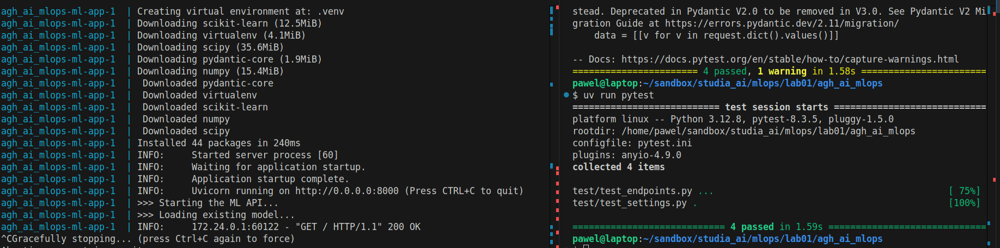

# Demo app

Proof of functionality :)

## Project structure

I've changed the structure slightly

- `app` dir for the whole app (so the main app is `app.main:app`)
- `__init__.py` used for loading components
- `app\models` for Pydantinc
